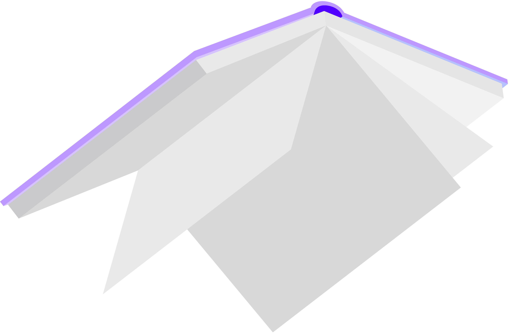
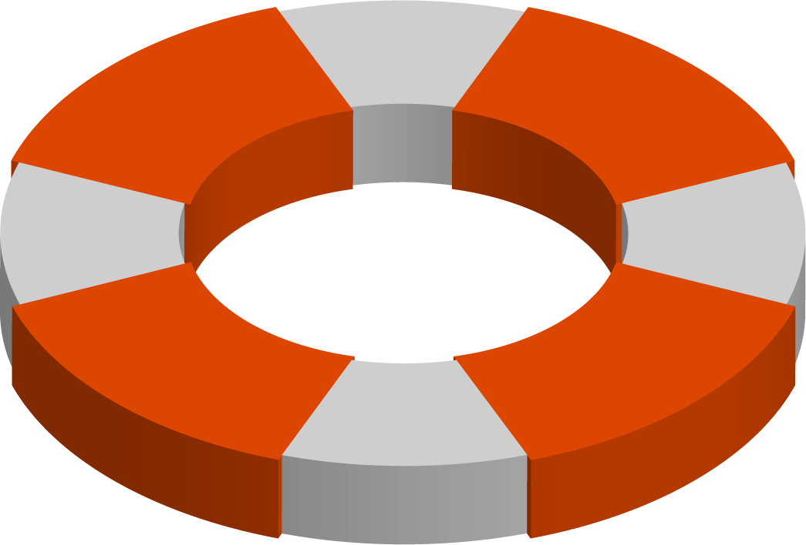

<h1 class="no-break"><a href="#welcome" class="header" id="welcome">Welcome to Luos documentation</a></h1>

<small><a href="https://github.com/Luos-io/Luos" target="blank">Luos revision: {{last_version_luos}}</a></small>

  

    
    
Get started

    
Learn the first step to use Luos.
  
  

  <a href="./docs/html/index.html">

    
    
Documentation

    
Browse through Documentation to learn more about Luos technology.
  
  
</a>
  <a href="./help/html/index.html">

    
    
Help

    
Consult Help pages to find how to resolve your issue.
  
  
</a>

## Introduction

We started designing Luos with the conviction that building electronic systems should be made easier than it is today. Most of the time should be spent developing the applications and behaviors instead of on complex and time-and-money-eating technicalities. To give a simple example, adding a new sensor &mdash;for instance, a distance sensor&mdash; to an electronic device in conception should not take more than a few minutes. So you can try, test, and iterate fast on a project to truly design what users want.

**Luos works like a <a href="https://en.wikipedia.org/wiki/Microservices" target="_blank">microservices architecture</a> in the software world and a containerization platform. It encapsulates any software or hardware functions to make them communicate and work with any other encapsulated service, no matter how they were developed, either on bare metal or on top of an embedded OS.**

### You are not familiar with Luos operations? Follow this flowchart:

<figure  class="print-break">
  <figcaption></figcaption>
  <ul class="tree">
    <li class="wf_li"> <strong>What do you want to do?</strong>
      <ul class="wf_ul">
        <li class="wf_li"><a href="./pages/overview/general-basics.md">Begin with the <b>basics</b></a>
          <ul class="wf_ul">
            <li class="wf_li"><strong class="cust_number">&#9312;</strong> Build a Luos-ready board
              <ul class="wf_ul">
                <li class="wf_li"><a href="./pages/embedded/hardware_topics/electronic-design.md">Read about the <b>electronic design rules</b></a>
                	<ul class="wf_ul">
                		<li class="wf_li"><a href="#step2">Go to 2 <strong>&#8599;</strong></a>
                		</li>
                	</ul>
                </li>
              </ul>
            </li>
           <li class="wf_li"><strong class="cust_number">&#9313;</strong> Make <b>drivers</b> and <b>apps</b> for your hardware
              <ul class="wf_ul">
                <li class="wf_li"><a href="./pages/embedded/dev-env.md">Choose and configure your <b>development environment</b></a>
                	<ul class="wf_ul">
                		<li class="wf_li"><a href="./pages/embedded/services.md">Read about <b>services</b> and how they work
</a>
                			<ul class="wf_ul">
                				<li class="wf_li"><a href="./pages/embedded/services/create-project.md">Create a <b>project</b></a>  then  <a href="./pages/embedded/services/create-services.md">start creating <b>services</b></a> and <a href="./pages/embedded/services/use-profiles.md"><b>profiles</b></a>
                					<ul class="wf_ul">
                						<li class="wf_li">Learn more about the tools and configurations available with Luos:  
											&#8594; <a href="./pages/embedded/services/od.md"><b>Object dictionary</b></a> 
											&#8594; <a href="./pages/embedded/services/routing-table.md"><b>Routing table</b></a> 
											&#8594; <a href="./pages/embedded/services/msg-handling.md"><b>Messages handling</b></a> 
											&#8594; <a href="./pages/embedded/services/self-healing.md"><b>Self-healing</b></a> 
											&#8594; <a href="./pages/embedded/services/streaming.md"><b>Streaming</b></a>
                							<ul class="wf_ul">
                								<li class="wf_li"><a href="./pages/embedded/services/examples.md">Read the Codes Examples</a> and <a href="https://community.luos.io/t/a-new-way-to-design-embedded-app-using-luos-intro/277">follow the bike alarm tutorial</a>
												
													<ul class="wf_ul">
								                		<li class="wf_li"><a href="#step3">Go to 3 <strong>&#8599;</strong></a>
								                		</li>
								                	</ul>
                								</li>
                							</ul>
                						</li>
                					</ul>
                				</li>
                			</ul>
                		</li>
                	</ul>
                </li>
              </ul>
            </li>
            <li class="wf_li"><strong class="cust_number">&#9314;</strong> Use Luos-ready boards and services
                <ul class="wf_ul">
                	<li class="wf_li"><a href="./pages/software/json-api.md#"> Learn how to use the <b>JSON API</b></a>
                		<ul class="wf_ul">
                			<li class="wf_li"><a href="./pages/software/pyluos.md"> Read about <b>Pyluos</b> and how to create behaviors</a>
                        <ul class="wf_ul">
                          <li class="wf_li"><a href="./pages/software/ros.md"> Read about <b>ROS</b> integration and how to use it with Luos</a>
                          </li>
                        </ul>
                			</li>
                		</ul>
                	</li>
                </ul>
            </li>
          </ul>
        </li>
      </ul>
    </li>
  </ul>
</figure>

If you have questions about a specific topic, you can refer or ask it on the <a href="https://community.luos.io" target="_blank">Luos' Forum</a>. And if you have suggestions about this documentation don't hesitate to create pull requests.

Watch this video for additional details:

<iframe class="cust_video" src="https://www.youtube.com/embed/xQe3z0M_FE8?feature=oembed" frameborder="0" allow="accelerometer; autoplay; encrypted-media; gyroscope; picture-in-picture" allowfullscreen></iframe> 

<small>Luos is under <a href="https://github.com/Luos-io/Luos/blob/master/LICENSE" target="_blank">Apache 2.0 license</a>.</small>
