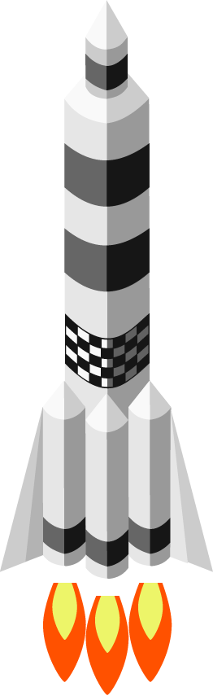

# Luos documentation and help

  

    

    
Get started

    
Learn the first step to use Luos.
  
  

  <a href="./docs/html/index.html">

    

    
Documentation

    
Browse the documentation to learn more about Luos technology.
  
  
</a>
  <a href="./docs/html/index.html">

    

    
API

    
Browse the API documentation.
  
  
</a>
  <a href="./help/html/index.html">

    

    
Tutorial

    
Access to tutorials on Luos use.
  
  
</a>
  <a href="./help/html/index.html">

    

    
FAQ

    
Consult FAQ page to find how to resolve your issue.
  
  
</a>

## About Luos

Luos is designed with the conviction that the development of electronic systems should be made easier than it is today. Indeed, most of the time should be spent developing applications and behaviors rather than consuming time and money on over-complex boards' technicalities and communication. 

> **For example**, adding a new sensor &mdash;for instance, a distance sensor&mdash; to a system you are conceiving should not take more than a few minutes, even on a fully developped and complex ready-to-produce electronic device. 

Luos allows you to try, test, and iterate faster on any project to design what users really want.

**Luos works like a <a href="https://en.wikipedia.org/wiki/Microservices" target="_blank">microservices architecture</a> designed for the software world, and a containerization platform. It encapsulates any software or hardware functions to make them communicate and work with any other encapsulated service, no matter how they were developed, either on bare metal or on top of an embedded OS.**

If you have questions about a specific topic, you can check out and post messages in our <a href="https://www.reddit.com/r/Luos/" target="_blank">Luos' community on Reddit</a>. And if you have suggestions about this documentation, don't hesitate to create pull requests.

<iframe class="cust_video" src="https://www.youtube.com/embed/xQe3z0M_FE8?feature=oembed" frameborder="0" allow="accelerometer; autoplay; encrypted-media; gyroscope; picture-in-picture" allowfullscreen></iframe> 

<small><a href="https://github.com/Luos-io/Luos" target="blank">Luos revision: {{last_version_luos}}</a> 
Luos is under <a href="https://github.com/Luos-io/Luos/blob/master/LICENSE" target="_blank">Apache 2.0 license</a>.</small>
