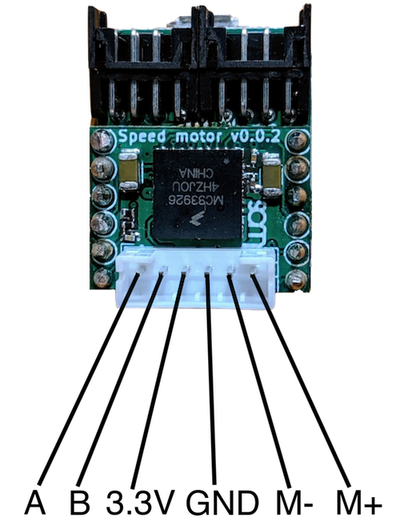

# Controller-motor board

<strong>Default Alias:</strong> controller_moto

<strong>Type:</strong> <a href="../../software/containers_list/controller-motor.md">Controller motor</a>

<strong>Number of container(s):</strong> 1

<strong>Image</strong>

<strong>Category(-ies)</strong>

<strong>Project source </strong>

<a class="github-button" data-size="large" aria-label="Star Luos-io/Luos on GitHub" href="https://github.com/Luos-io/Examples/blob/master/Projects/l0/Controller_motor" target="_blank">Controller_motor</a>

## How to connect your motor-reducer to your boards

The Controller-motor board is designed to control motors with a reducer and a sensor. It provides PH connector with 6 pins, where the motor can be plugged.

### Connector's reference

 Male connector's reference (on the board): <a href="https://octopart.com/b6b-ph-k-s%28lf%29%28sn%29-jst-248872" target="_blank">**B6B-PH-K-S(LF)(SN)**</a>)

 Female connector's reference (on the wire): <a href="https://octopart.com/phr-6-jst-279165" target="_blank">**PHR-6**</a>

 Crimp's reference (on the wire): <a href="https://octopart.com/bph-002t-p0.5s-jst-8407485" target="_blank">**BPH-002T-P0.5S**</a>

### Pinout and characteristics

 *PHR-6 connector pinout.*

This board accepts supply voltage from 7V to 24V.

To control regular DC motors (without reduction neither sensor), please refer to [DC motor board](./dc-motor.md)’s documentation.

> **Warning:** The USB board provides too weak power to drive a motor-reducer with this board. A power board such as Battery board or Power plug board shall be used.

This board is able to control DC motors with a reduction and a sensor (usually called motor-reducer or speed-reducer).

The Controller-motor board provides a PID control on the output position, and PID control on the output speed, taking into account the reducer and the encoder.

You can find basic information about PID control here: <a href="https://medium.com/luosrobotics/an-introduction-to-pid-control-with-dc-motor-1fa3b26ec661" target="_blank">**An introduction to PID control with DC motor**</a> and a example code to tune your PID on the [Controller motor container](../../software/containers_list/controller-motor.md) page of this documentation.

