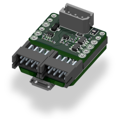
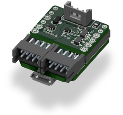

# Dynamixel board

<strong>Default Alias:</strong> dxl_*id*

<strong>Type:</strong> N x <a href="../../high/containers_list/dxl.md">Dynamixel motor</a>

<strong>Number of container(s):</strong> N

<strong>Image</strong>

<strong>Category(-ies)</strong>

<strong>Project source </strong>

<a class="github-button" data-size="large" aria-label="Star Luos-io/Luos on GitHub" href="https://github.com/Luos-io/Examples/tree/master/Projects/l0/Dxl" target="_blank">Dxl</a>

## Versions of Dynamixel board

There are two versions of this board. One is the version for XL320 Dynamixel, the other is for other types of Dynamixel (eg. AX12). Both boards have a different connector.

Except for this connection, both versions work exactly the same way.

## How to connect and start the motors to the board

The Dynamixel board is special because it has a dynamic number of visible containers, depending on the number of motors plugged to it. If you have 5 motors on your board, you will see 5 DynamixelMotor containers.

> **Note:** If you don’t plug any motor to the board, it will create a special container called `void_dxl`.

This board creates containers dynamically upon motor detection. So in order to create containers, this board has to detect motors, and to detect them each motor needs to have a proper power supply.

Indeed, if you power the Luos network with an unadapted voltage, the motors won’t reply to the board requests and you won’t be able to see any Dynamixel container on your network.

To be detected, the Dynamixel motors need to use a baudrate of 1 000 000 `baud` and to have an ID between 1 and 30.

When your Dynamixel motors are properly configured, you can connect them to the Luos network. Be sure to respect the following order to have a proper start-up:

1. Connect the {{board}} board to the Luos network and to the Dynamixel motors.
2. Connect the correct power supply to the luos network.
3. Connect the USB board to your computer.
4. Wait for the blue LED at the back of the board to turn off.

> **Note:** The blue LED is ON when the network is busy detecting Dynamixel motors.

In order to begin using this board, you must disable the compliant mode, and you can then use the functions and variables of the [Dynamixel container](../../high/containers_list/dxl.md).

> **Warning:** Dynamixel boards don’t belong to the power category. Thus, do not power your motors on the Robotis side, you won’t be able to share this power with others boards.

