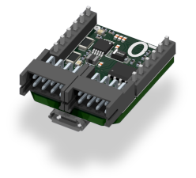
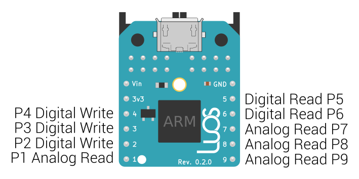

# GPIO board

<strong>Default Alias:</strong> analog_read_P1, analog_read_P7, analog_read_P8, analog_read_P9, digit_read_P5, digit_read_P6, digit_write_P2, digit_write_P3, digit_write_P4

<strong>Types:</strong> <a href="../../high/containers_list/state.md">State</a>, <a href="../../high/containers_list/voltage.md">Voltage</a>

<strong>Number of container(s):</strong> 9

<strong>Image</strong>

<strong>Category(-ies)</strong>

<strong>Project source </strong>

<a class="github-button" data-size="large" aria-label="Star Luos-io/Luos on GitHub" href="https://github.com/Luos-io/Examples/blob/master/Projects/l0/Gpio" target="_blank">Gpio</a>

## GPIO pinout and power consideration

The GPIO board allows you to use the pins of the L0 board through the Luos system. You can use `Digital Write`, `Digital Read`, or `Analog Read` pins.

This board creates a container for each available pin.

## Power considerations
The GPIO board supports 5V to 24V DC input.

> **Warning:** The pins only support 3.3V.

