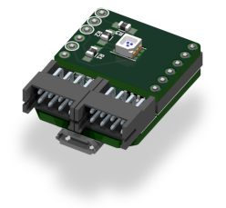

# RGB LED board

<strong>Default Alias:</strong> rgb_led_mod

<strong>Type:</strong> <a href="/pages/high/containers_list/color.md">Color</a>

<strong>Number of container(s):</strong> 1

<strong>Image</strong>

<strong>Category(-ies)</strong>

<strong>Project source </strong>

<a class="github-button" data-size="large" aria-label="Star Luos-io/Luos on GitHub" href="https://github.com/Luos-io/Examples/tree/master/Projects/Led" target="_blank">Led</a>

## Board function
This board contains an RGB LED that can be controlled to make a light of any chosen color.
Refer to the [Color container page](../../high/containers_list/color.md) for more details.

## Power considerations
The RGB LED board supports 5V to 24V DC.

