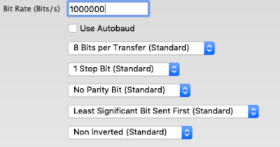

# USB board
<div class="cust_sheet" markdown="1">
<p class="cust_sheet-title" markdown="1"><strong>Default Alias:</strong> gate</p>
<p class="cust_sheet-title" markdown="1"><strong>Type:</strong> <a href="../../high/containers_list/gate.md">Gate</a></p>
<p class="cust_sheet-title" markdown="1"><strong>Number of container(s):</strong> 1</p>
<p class="cust_sheet-title" markdown="1"><strong>Image</strong></p>
<p class="cust_indent" markdown="1"></p>
<p class="cust_sheet-title" markdown="1"><strong>Category(-ies)</strong></p>
<p class="cust_indent" markdown="1">


</p>
<p class="cust_sheet-title" markdown="1"><strong>Project source </strong></p>
<a class="github-button" data-size="large" aria-label="Star Luos-io/Luos on GitHub" href="https://github.com/Luos-io/Examples/tree/master/Projects/Gate" target="_blank">Gate</a>
</div>

## Driver installation
With Windows, you must install `VCP` and `D2XX` drivers first. They are available for download on these pages:

<a href="https://www.ftdichip.com/Drivers/VCP.htm" target="_blank">https://www.ftdichip.com/Drivers/VCP.htm</a>

<a href="https://www.ftdichip.com/Drivers/D2XX.htm" target="_blank">https://www.ftdichip.com/Drivers/D2XX.htm</a>

Select the files to download according to your system (x86 or x64) and install them on your computer.


## How to connect the USB board to your computer
There are 2 micro-USB ports, but one of them is only used to manually update the board. The other one is the one we will use in this page.

The right USB port used on this page is the one at the opposite of the 2 Luos connectors.


## How to use the USB board
Luos' USB board acts like a serial port on your system.
To control your device, you have to get and set Json data into the serial port opened by the USB board. In order do that with Pyluos, you can use the following python code:

```python
from pyluos import Device
device = Device('COM13')
device.containers
```

### On Windows
On Windows, a *COM* port is usually used (like `COM1`, `COM2`, `COM3`, etc.). It can be found in *Device Manager* (right-click on *Start* button), after it’s plugged:


Once the port is known, the connexion can be set on Pyluos with python:

```python
device = Device('COM27')
```

### On MacOS
To list the available serial ports, use the following command line:

```bash
ls /dev/cu.usbserial-*
```

Once the port is known, the connexion can be set on Pyluos with python:

```python
device = Device('/dev/cu.usbserial-DN30VKKB')
```

### On Linux
To list the available serial ports, type the following in a terminal:

```bash
dmesg | grep tty
```

Once the port is known, the connexion can be set on Pyluos with python:

```python
device = Device('/dev/ttyS0')
```


### Serial connectivity with other languages

In order to communicate from a computer to a Luos network through a gate, a serial connection can be established. This serial connectivity must have the following parameters:

 - Baudrate: 1,000,000 Bits/s
 - 8 Bits per transfer
 - 1 stop bit
 - No parity bit
 - Least significant bit sent first
 - Non inverted

 

 Although the connection can be made with Pyluos, the Python library, other languages can be used on the computer side. Here is a C Linux serial connection example:

 ```C
void init_luos_comm(luos_t* m)
{
  m->serial_fd = open(SERIAL_PORT, O_RDWR);

  // Check for errors
  if (m->serial_fd < 0)
  {
      printf("Error %i from open: %s\n", errno, strerror(errno));
      return -1;
  }

  struct termios tty;
  memset(&tty, 0, sizeof tty);

  if (tcgetattr(m->serial_fd, &tty) != 0)
  {
      printf("Error %i from tcgetattr: %s\n", errno, strerror(errno));
      return -1;
  }

  tty.c_cflag &= ~PARENB;        // Disable parity
  tty.c_cflag &= ~CSTOPB;        // Clear stop field
  tty.c_cflag |= CS8;            // 8 bits per byte
  tty.c_cflag &= ~CRTSCTS;       // Disable RTS/CTS hardware flow control
  tty.c_cflag |= CREAD | CLOCAL; // Turn on READ & ignore ctrl lines (CLOCAL = 1)
  tty.c_lflag &= ~ICANON;        // Disable canonical mode
  tty.c_lflag &= ~ECHO;          // Disable echo
  tty.c_lflag &= ~ECHOE;         // Disable erasure
  tty.c_lflag &= ~ECHONL;        // Disable new-line echo
  tty.c_lflag &= ~ISIG;          // Disable interpretation of INTR, QUIT and SUSP

  // Turn off s/w flow ctrl
  tty.c_iflag &= ~(IXON | IXOFF | IXANY);

  // Disable any special handling of received bytes
  tty.c_iflag &= ~(IGNBRK|BRKINT|PARMRK|ISTRIP|INLCR|IGNCR|ICRNL);

  // Prevent special interpretation of output bytes (e.g. newline chars)
  tty.c_oflag &= ~OPOST;

  // Prevent conversion of newline to carriage return/line feed
  tty.c_oflag &= ~ONLCR;

  // Wait for up to 1s (10 deciseconds), returning as soon as any data is received.
  tty.c_cc[VTIME] = 10;
  tty.c_cc[VMIN] = 0;

  // Set in/out baud rate to be 1000000
  cfsetispeed(&tty, B1000000);
  cfsetospeed(&tty, B1000000);

  // Save tty settings
  if (tcsetattr(m->serial_fd, TCSANOW, &tty) != 0)
  {
      printf("Error %i from tcsetattr: %s\n", errno, strerror(errno));
      return -1;
  }
  fcntl(m->serial_fd, F_SETFL, FNDELAY);
  usleep(500000);
}
```


## USB board power delivery
The USB board power-delivery in the Luos network is limited to `500 mA`. This board can’t power too many boards and power-demanding ones like, for example, a DC-motor board with one or two motors connected. If you experiment power issues, feel free to add a power category board like a [Jack power input board](./jack-power-input.md).
