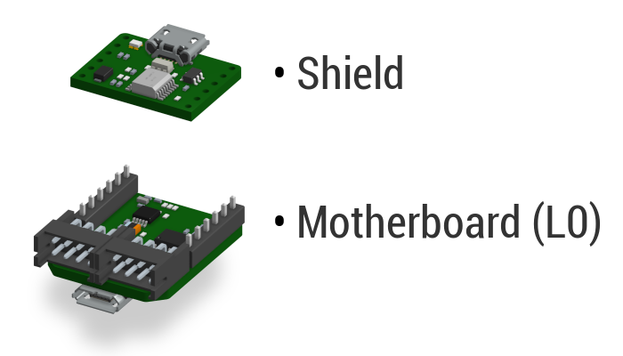
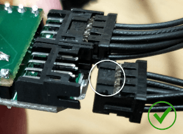
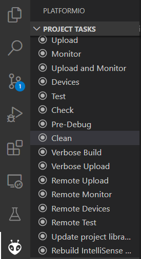

# General guide to Luos electronic boards

Luos library has been designed to run on low-cost hardware. It works with all Arm microcontrollers, starting with the smallest and cheapest one: the <a href="https://developer.arm.com/ip-products/processors/cortex-m/cortex-m0" target="_blank">Cortex-M0</a>. 

The demonstration boards are a set of small electronic boards examples, each one hosting Luos and providing with an electronic function (motor, distance sensor, battery, LED, potentiometer, etc.). These boards can be used to test the technology, or to quickly develop an electronic device prototype in order to prove a concept without any knowledge in electronics: demonstration boards are connected together with cables, behaviors can be programmed through a [gate](./boards_list/usb.md) board on a computer, and the device can be tested in a matter of minutes!

> **Warning:** All examples codes of this documentation use the Pyluos Python library and are adapted to be used with Jupyter Notebook.

## Boards general specifications
Almost every demonstration board in the provided examples is composed of a motherboard and a shield board. The motherboard, called L0, has a <span class="cust_tooltip">node<span class="cust_tooltiptext">{{node_def}}</span></span> that hosts Luos. The shield board is added to a L0 to type it with an electronic function.



> Note: Power category boards don't include L0 motherboard as they provide only with power functions and don't need communication. However. he communication data pass through their connectors to other communicating boards.

Here are the specifications of this motherboard:

{{ #include ./../../_includes/specs.md }}

## Boards categories
Luos boards examples are organized in 6 categories. Each board belongs to at least one of these categories. Understanding every categories will help to understand how to connect the Luos boards together in order to achieve any type of electronic system.


**Below is the list of the six categories:**

|Sensor|Actuator|Communication|
|:-|:-|:-|
||||
|Sensor boards are able to measure the physical world.|Actuation boards are able to act on the physical world.|Communication boards (also called gates) are able to share your system’s inputs, outputs and configurations outside of your device, using a JSON API.|

|Cognition|Interface|Power|
|:-|:-|:-|
||||
|Cognition are boards dedicated to execute your code or host your AI.|These boards are built to interact with the user of the machine.|Power boards are able to share their input power source into the <span class="cust_tooltip">Robus<span class="cust_tooltiptext">{{robus_def}}</span></span> wire to feed other boards.|

<a name="plug"></a>
## Plugging boards together
Luos boards have at least 2 connection ports in their design. All connectors are the same, so that any board can be connected to another one using any of these ports. Just avoid to make a loop circuit, otherwise you will inhibit communication between containers.

There is a correct side to plug a cable’s connector to a board. The small tab on the connector must face upward to plug correctly, as shown on the following pictures:

|||
|:-|:-|
|Wrong side, the upper surface is flat|Right side, the tab is visible on the upper surface|

## Power management
Luos boards can share their power inputs through the network connection, allowing you to feed other boards. These boards belong to the **power category**.
All the Luos boards can manage a voltage between 5V and 24V, up to 7A.

In a Luos network, **you can have multiple power category boards**. In this case, **the power board with the highest voltage takes over** and shares its power with other boards.

For example, for a device using a 12V motor and an USB board: The USB board belongs to the power category, so it can share its 5V into the network's wires. But you need 12V for your motor, so you will have to add a 12V AC plug board in your network to supply the motor. In this case, the USB board doesn’t share its power, only the AC plug board does, because 5V < 12V.

Some components needs a specific voltage to work properly. For example, in order to use standard servomotor, you have to feed the Luos network with 5V or 7V. If you need to combine 7V and 12V motors in a system, for example, you can manage multiple voltages on the same network using a [power isolator board](./boards_list/power-isolator.md).

## External communication management
The boards from the Communication category allow you to easily control a Luos network. These boards host a container called "gate", they can communicate using different kinds of technologies and reach devices outside the device.<br/>To start using Luos technology, you have to use at least one of these gates to be able to program your machine's behaviors.

The "gate" container's task is to stream the Luos network activity into a standard JSON format file, and on the oposite to allow an external device to easily interact with any device in the network.

This way, it’s **easy to use** your favorite device and language to interact and control your device.

We created an open-source **Python library** managing this JSON API called [*Pyluos*](../software/pyluos.md). Feel free to use it, copy it, and convert it into your favorite language. We are open to contribution for any programing languages. You can suggest any change or new API on the <a href="https://community.luos.io/" target="_blank">Luos' forum</a>.

Get <a href="https://github.com/Luos-io/Pyluos" target="_blank">Pyluos on github</a>.

## Update Luos, Robus and board's firmware
[Instal PlatformIO](../embedded/dev-env.html) if you don't have it yet and clone the [Examples](https://github.com/Luos-io/Examples) repository.

To update Luos, <span class="cust_tooltip">Robus<span class="cust_tooltiptext">{{robus_def}}</span></span> or your containers' code, you must open the librairies tab  on PlatformIO in Visual Studio Code:


To update the board's firmware you need to follow 3 steps:

### 1. Open the container folder that you want to update in Visual Studio Code
To do this, you must go to *File* -> *Open the folder* and go to the folder of the container you want from [Examples/Projects](https://github.com/Luos-io/Examples/tree/master/Projects).

### 2. Compile it to ensure there is no error
To compile your code, you must click on the *Compile* button  at the bottom of your window:


If your terminal looks like this, it means that your download was successful:


If the compilation goes wrong in spite of your code having been perfectly compiled, perform a clean-up by clicking on the ant button  and choosing *Clean* in the list of project tasks:



### 3. Upload the new code into the board
To upload the new code into the board you must click on the *Upload* button :


If your terminal looks like this, it means that your download was successful:


### Troubleshooting
If the upload does not go as planned, it may be because your driver is not up-to-date. The fix depends on your OS:

#### Windows
You need to install and run *Zadig* by following <a href="https://github.com/profezzorn/ProffieOS/wiki/zadig" target="blank_">this tutorial</a> on github.

#### Linux
You need permissions to access the device for non-root users:
```bash
echo 'SUBSYSTEMS=="usb", ATTRS{idVendor}=="0483", ATTRS{idProduct}=="df11", GROUP="plugdev", MODE="0666"' > /etc/udev/rules.d/60-luos.rules
```
