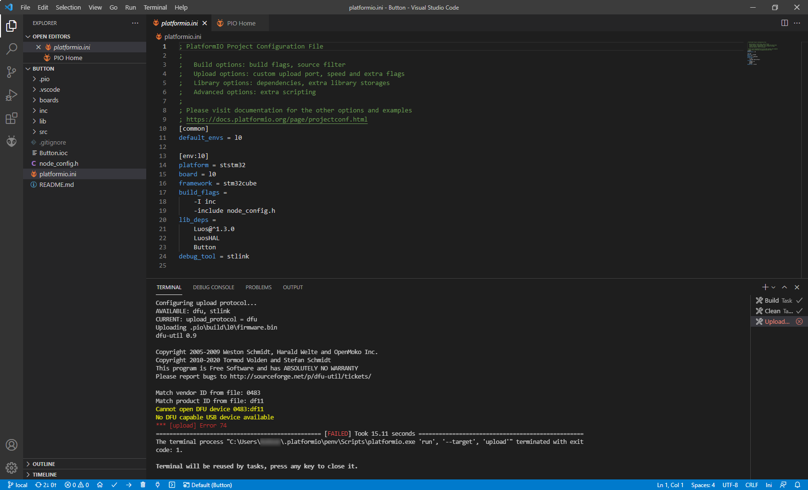

# How to update my USB drivers

## Symptom(s) 

When connecting to a Luos system through a gate, an error message appears on PlatformiO:




## Possible explanation

Your USB drivers are not up-to-date on your computer.

## Resolution

### Update your USB driver

You may need to update you USB driver. The process depends on your OS:

#### Windows
You need to install and run **Zadig** by following <a href="https://github.com/profezzorn/ProffieOS/wiki/zadig" target="blank_">**this tutorial**</a> on GitHub.

Installing the drivers:


PlatformIO's screen after successful driver installation:


#### Linux
You need permissions to access the device for non-root users:
```bash
echo 'SUBSYSTEMS=="usb", ATTRS{idVendor}=="0483", ATTRS{idProduct}=="df11", GROUP="plugdev", MODE="0666"' > /etc/udev/rules.d/60-luos.rules
```

#### MacOS
You need to install **libusb**: 
```bash
ruby -e "$(curl -fsSL https://raw.githubusercontent.com/Homebrew/install/master/install)" < /dev/null 2> /dev/null
brew install libusb
```

---

> **Associated documentation page(s):** 
> - [Gate](../tools/gate.md)
