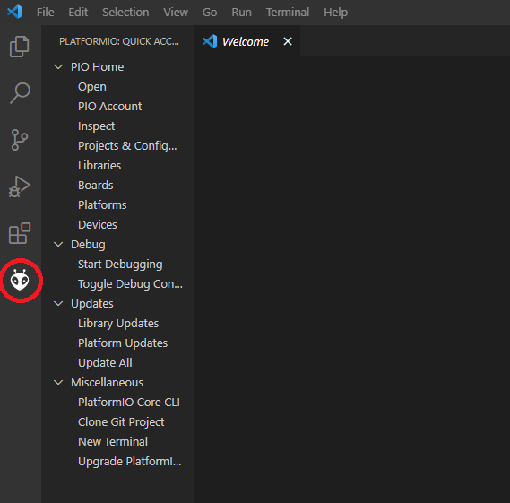
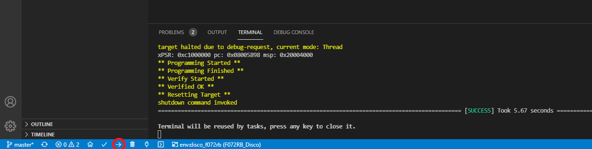
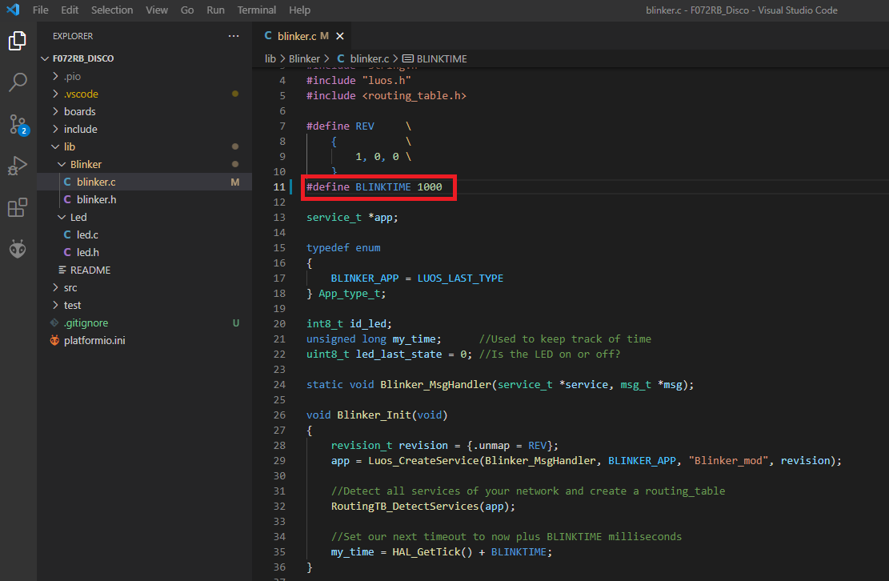

# Run your first App

This tutorial shows you how to quicly upload a Luos application on an MCU development kit.

Supported boards are listed below:
- Arduino zero
- STM32F072RB Discovery
- STM32L432KC Nucleo

> **Note:** This list will grow larger with time

## Setup development environment

Install the free coding editor <a href="https://code.visualstudio.com/" target="_blank">Microsoft Visual Studio Code</a> (VSCode). Once done, open it, you should see the following screen: 

<p align="center">
  
</p>

Then install  <a href="https://platformio.org/platformio-ide" target="_blank">PlatformIO</a> plugin in VSCode and relaunch it, the PIO extension icon should appear on the left: 

<p align="center">
  
</p>

## Clone the project

Clone the *getting started* repository on your computer: 

```bash
git clone https://github.com/Luos-io/getting_started.git
```

If you are not familiar with Git, you can consult <a href="https://git-scm.com/doc" target="_blank">their documentation</a>.

## Flash your board depending on which one you have

Open VSCode and click on **Open Folder** in the project explorer on the left, then select a project depending on the board you have chosen. For example, for the STM32F072RB discovery, open **F072RB_Disco** in the folder explorer then click on **ADD**:

<p align="center">
  
</p>

The project folder is opened in the explorer. You can now flash your board: make sure it's connected to your PC with a USB cable and click on **Upload** on the bottom left of the VSCode window:

<p align="center">
  
</p>

PlatformIO will build the firmware and flash it. Take a look at the terminal, you can see each step platformIO follows and a **Success** message at the end. If you have any trouble with your USB driver, you can consult [this FAQ page](/pages/faq/002.dfu.md). Once the board is programmed, you should see the **LED** blinking on your board.

Congratulations, your first Luos app is running !

## Going further

Now you can learn more about how this system works. Without diving into too much details, we will slightly modify our app and see what happens: open the **lib** folder in your project explorer. You should see two folders: *Led* and *Blinker*. They represent two [**services**](/pages/luos-technology/services/services.md) which are currently running on your board:
- *Blinker* sends a message at a fixed duration
- *Led* receives this message and makes the LED blink

Let's modify this duration: open **blinker.c** and change the `BLINKTIME` value from 500 to 1000:

<p align="center">
  
</p>

The LED now blinks two times slower.

## Next steps

Your development environment is now installed and you have a Luos app running on your MCU. Check [tutorials](../tutorials/tutorials.md) to learn how to use each feature of Luos technology. You can also read the [Luos documentation](../luos-technology/luos_tech.md) to learn more about the core technology.
