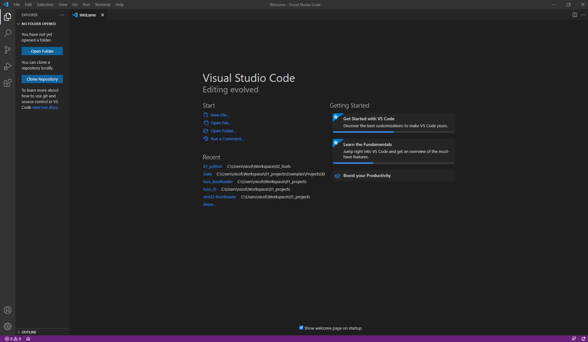
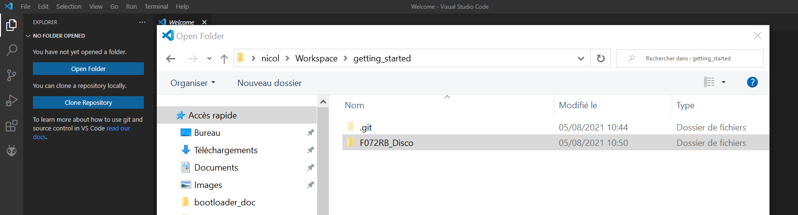

# Getting started

This page allow you to build flash run and control your very first luos code.

This Getting started is separated in 2 parts :
 - **The embedded part** : By following this part you will have all the tools you need to easily develop using Luos in your embedded target.
 - **The remote control part** : By following this part you will have all the tools you need to take control and easily test any Luos device.

## The embedded part : Run your first Embedded App!

This tutorial shows you how to quickly upload a Luos application on an MCU development kit.

Supported boards are listed below:
- Arduino zero, MKRzero, MKR1000, or any SAMD21 based Arduino board
- STM32L432KC Nucleo

> **Note:** This list will grow larger with time

### Setup development environment

We will use <a href="https://platformio.org/platformio-ide" target="_blank">PlatformIO &#8599;</a> as development environment.

First install the free coding editor <a href="https://code.visualstudio.com/" target="_blank">Microsoft Visual Studio Code &#8599;</a> (VSCode), PlatformIO IDE is built on top of it.

Then :
 1. Open VSCode Extension Manager
 2. Search for official [PlatformIO IDE](https://marketplace.visualstudio.com/items?itemName=platformio.platformio-ide) extension
 3. Install PlatformIO IDE.

<p align="center">
  
</p>

### Clone the project

Clone the *getting started* repository on your computer: 

```bash
git clone https://github.com/Luos-io/getting_started.git
```

If you are not familiar with Git, you can consult <a href="https://git-scm.com/doc" target="_blank">their documentation &#8599;</a>.

### Flash your board depending on which one you have

Open VSCode and click on **Open Folder** in the project explorer on the left, then select a project depending on the board you have chosen. For example, for the STM32L432KC Nucleo, open **L432KC_Nucleo** in the folder explorer then click on **ADD**:

<p align="center">
  
</p>

The project folder is opened in the explorer.

> **Note:** For arduino users you can select your board on the `platformio.ini` file by modifying the `board = zero` line.

You can now flash your board: make sure it's connected to your PC with a USB cable and click on **Upload** on the bottom left of the VSCode window:

<p align="center">
  
</p>

PlatformIO will build the firmware and flash it. Take a look at the terminal, you can see each step platformIO follows and a **Success** message at the end. If you have any trouble with your USB driver, you can consult [this FAQ page](../faq/002.dfu.md). Once the board is programmed, you should see the **LED** blinking on your board.

Congratulations, your first Luos app is running !

### What is going on

There is two [**services**](../luos-technology/services/services.md) loaded in your board allowing to blink the led.

- **Blinker** sends a message at a fixed duration</br> ╰ located at the root of the *getting_started* repository (because the same app can run on any board)
- **Led** receives this message and makes the LED blink</br> ╰ located on the lib folder of your project (because it's a driver specific to your board)

On top of it we also add 2 other services allowing you to take control of your board :

- **Pipe** managing a serial interface</br> ╰ located on the lib folder of your project (because it's a driver specific to your board)
- **Gate** an app that translate Luos to Json and send it trough *Pipe*</br> ╰ located on the cloud, (because it's a common cross platform Luos app) Platformio just downloaded it for you.

## The remote control part : 💊 You can control the Matrix.

The gate running on your board allow you to take control of any service loaded on your device.

### Setup development environment

We will use python with the default library of Luos called pyluos.
To install it run :
```bash
pip install pyluos
```

### Connect and control your device

You board should give you access to a serial port (`COM*` on windows, `/dev/tty*` on linux, `/dev/cu.*` on mac). When you get it run

```bash
pyluos-shell --port SERIAL_PORT
```

For example :

```bash
$ pyluos-shell --port /dev/cu.usbmodem13102

Connected to "/dev/cu.usbmodem13102".
Sending detection signal.
Waiting for routing table...
Device setup.

 Hit Ctrl-D to exit this interpreter.

Your luos device have been successfully mounted into a "device" object:
  ┏━━━━━━━━━━━━━━━━━━━━━━━━━━━━━━━━━━━━━━━━━━━━━━━━━━┓
  ┃  ╭node 1            /!\ Not certified            ┃
  ┃  │  Type                Alias               ID   ┃
  ┃  ├> State               led                 2    ┃
  ┃  ├> Pipe                Pipe                3    ┃
  ┃  ├> Gate                gate                1    ┃
  ┃  ╰> Unknown             blinker             4    ┃
╔>┗━━━━━━━━━━━━━━━━━━━━━━━━━━━━━━━━━━━━━━━━━━━━━━━━━━┛

```
Now you are on an Ipython command line, you can run python script in it.
The `device` object is your real device and you can interact with it for example try to execute those lines one by one :


In [1]: `device.blinker.time=0.25`</br>
In [2]: `device.blinker.pause()`</br>
In [3]: `device.led.state=True`</br>
In [4]: `device.led.state=False`</br>
In [5]: `device.blinker.play()`

## Next steps

Your development environment is now installed and you have a Luos app running on your MCU. Check [tutorials](../tutorials/tutorials.md) to learn how to use each feature of Luos technology. You can also read the [Luos documentation](../luos-technology/luos_tech.md) to learn more about the core technology.
