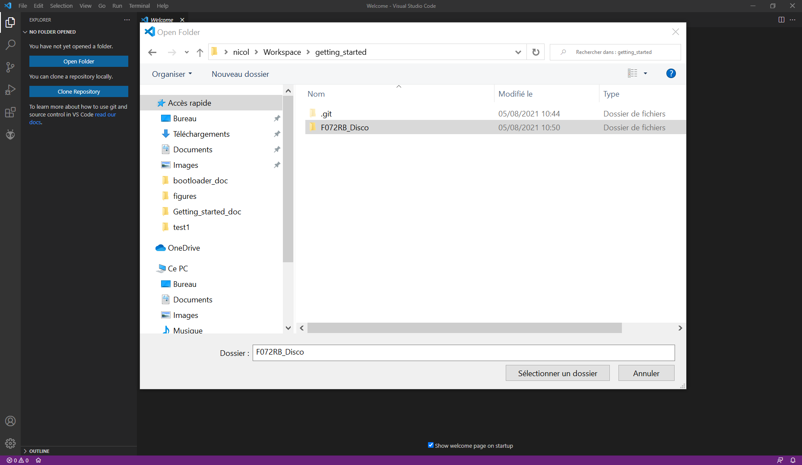
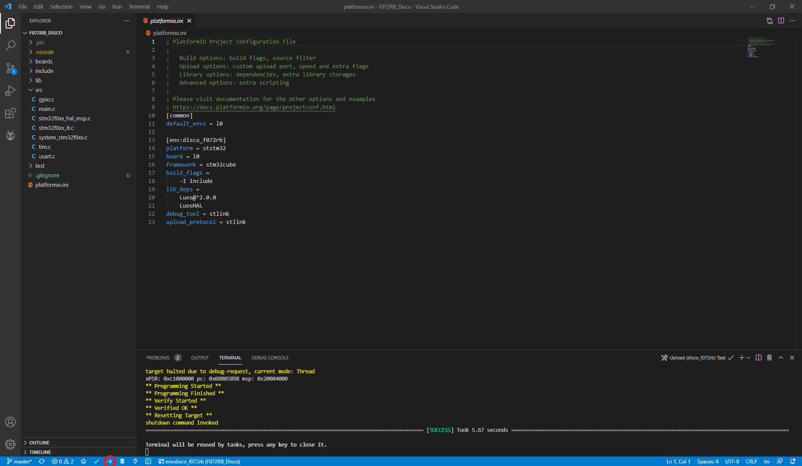
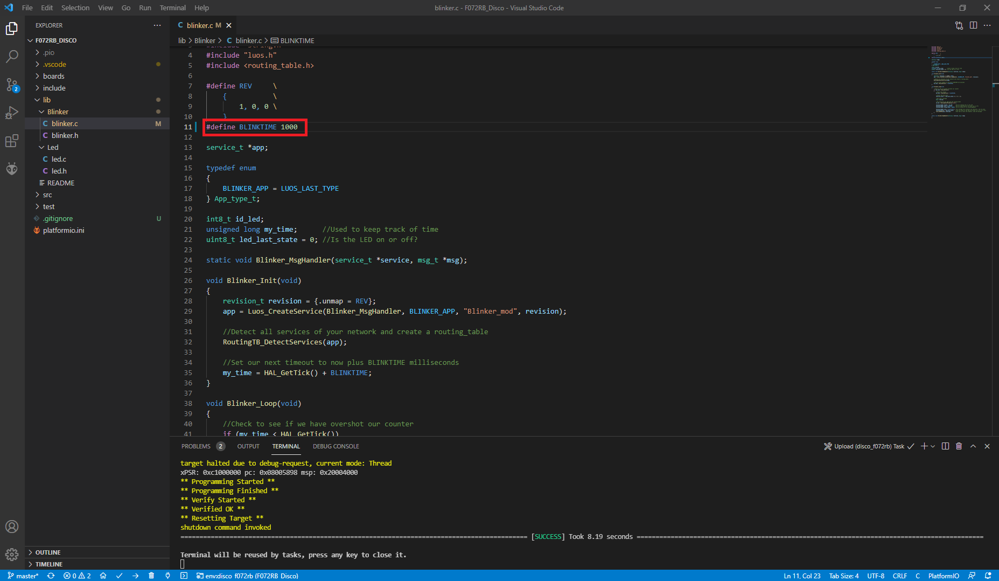

# Run your first App

This tutorial shows you how to quicly upload a luos app on a MCU developpement kit.

Supported boards are listed below:
- STM32F072RB Discovery

## Setup development environment

Install <a href="https://code.visualstudio.com/" target="_blank">VSCode</a>. Once done, open it, you should see the following screen: 

<p align="center">
  
</p>

Then install <a href="https://platformio.org/platformio-ide" target="_blank">PlatformIO</a> plugin and relaunch VSCODE, the PIO extension icon should appear on the left: 

<p align="center">
  
</p>

## Update your USB driver

You may need to upload you USB driver. The process depends on your OS:

### Windows
You need to install and run **Zadig** by following <a href="https://github.com/profezzorn/ProffieOS/wiki/zadig" target="blank_">this tutorial</a> on github.

### Linux
You need permissions to access the device for non-root users:
```bash
echo 'SUBSYSTEMS=="usb", ATTRS{idVendor}=="0483", ATTRS{idProduct}=="df11", GROUP="plugdev", MODE="0666"' > /etc/udev/rules.d/60-luos.rules
```

## Clone project depending on your board

Clone *getting started* reposetory on your machine: 

```bash
git clone https://github.com/ncros3/getting_started.git
```

## Flash your board

Open VScode then click on **Open Folder** in the project explorer on the left, select **F072RB_Disco** in the folder explorer then click on **ADD**:
<p align="center">
  
</p>

The project folder is opened in the explorer. You can now flash your board: make sure it's connected to your PC with a USB cable and click on **upload** on the bottom left of the VSCode window:

<p align="center">
  
</p>

PlatformIO will build the firmware and flash it. If you have any trouble with your USB driver, please follow steps described above. If all steps passed, you should see the **LED3** blinks on your board.

Congratulations, your first luos app is running on your board !

## Going further

Now you would like to know how this system works. Without diving into too much details, we will slightly modify our app and see what appens: open the **lib** folder in your project explorer. You should see two folders: *Led* and *Blinker*. They represents two **services** wich are actually running on your board:
- *Blinker* send a message at a fixed period
- *Led* receives this message and blink the led

Let's modify this period, open **blinker.c** and change BLINKTIME from 500 to 1000:

<p align="center">
  
</p>

The led now blinks two times slower.

## Next steps

Your developpement environment is now installed and you have a luos app running on your MCU. Check [tutorials](../tutorials/tutorials.md) to learn how to use each feature of luos technology. You can also read the [luos documentation](../luos-technology/luos_tech.md) to learn more about the core technology.