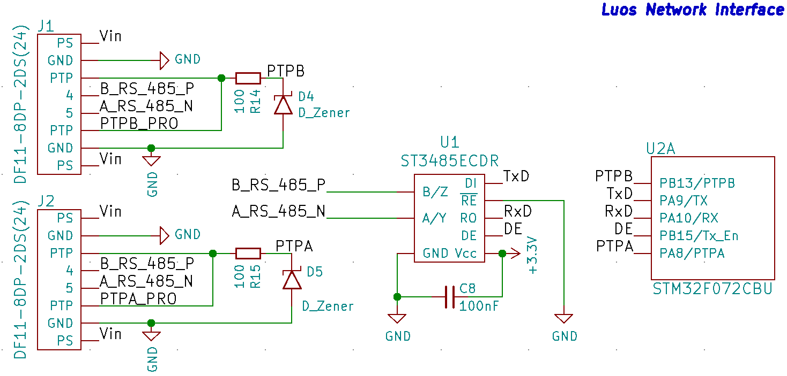

# Integrating Luos into an electronic board
To create and match with a default reference design, electronic boards must respect some design rules in order to properly work in a Luos network.

## Electronic design

A Luos-friendly electronic board must contain *at least* the following elements:
 - **1** <a href="https://en.wikipedia.org/wiki/Microcontroller" target="_blank">**MCU**</a> (microcontroller unit): It hosts, as a node, the Luos firmware along with the different services{{service_def}} (drivers and apps).
 - **At least 2 connectors**: They allow to link boards together into a Luos network and link them as a daisy-chain or star mounting. Through PTP pins, nodes know if there is another node connected to the connector. This is used when the user wants to make a topology detection of the system.

## One-wire reference design

Luos' One-wire official connector is: <a href="https://octopart.com/df11-4dp-2ds%2852%29-hirose-261749" target="_blank">*DF11-4DP-2DS*</a>.

## RS485 reference design

Luos' RS485 official connector is: <a href="https://octopart.com/df11-8dp-2ds%2824%29-hirose-39521447" target="_blank">*DF11-8DP-2DS*</a>.

See default pinout configuration in <a href="https://github.com/Luos-io/LuosHAL" target="_blank">luos_hal_config.h</a> files for the MCU family chosen.

