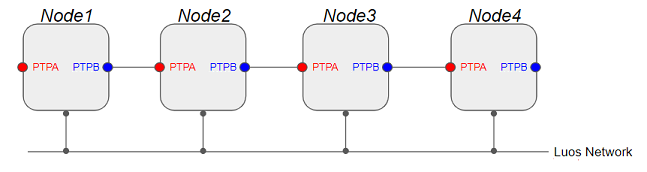
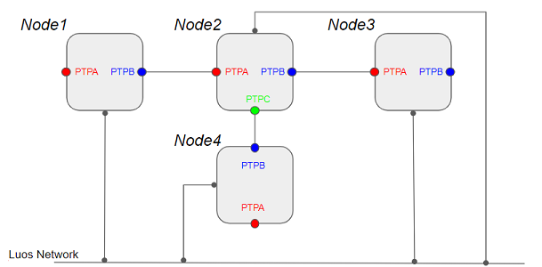

# Integrating Luos into an electronic board
To create and match with a default reference design, electronic boards must respect some design rules in order to properly work in a Luos network.

## Electronic design
Board examples and electronic sources are available <a href="https://github.com/Luos-io/Examples/tree/master/Projects" target="_blank">on GitHub</a>. You are free to use them as you want.

You can find the schematic of a Luos-ready board called L0 <a href="https://en.wikipedia.org/wiki/Microcontroller" target="_blank">on Github<a> for a quick hardware example.

A Luos-friendly electronic board must contain *at least* the following elements:
 - **1** <a href="https://en.wikipedia.org/wiki/Microcontroller" target="_blank">**MCU**</a> (microcontroller unit): It hosts, as a node, the Luos firmware along with the different containers{{container_def}} (drivers and apps).
 - **At least 2 connectors**: They allow to link boards together into a Luos network as a daisy-chain. Through PTP pins, nodes know if there is another node connected to the connector. This is used when the user wants to make a topology detection of the system.

## One-wire reference design

Luos' One-wire official connector is: <a href="https://octopart.com/df11-4dp-2ds%2852%29-hirose-261749" target="_blank">*DF11-4DP-2DS*</a>.

## RS485 reference design

Luos' RS485 official connector is: <a href="https://octopart.com/df11-8dp-2ds%2824%29-hirose-39521447" target="_blank">*DF11-8DP-2DS*</a>.

## Compatible MCUs
Luos can manage any type of microcontrollers as long as they are first added to the library manually. If your microcontroller is not supported yet, please contact us:
 - by mail: <a href="mailto:hello@luos.io">hello@luos.io</a>
 - on <a href="https://github.com/Luos-io/Luos/issues/new?assignees=nicolas-rabault&labels=porting&template=porting-request.md&title=%5BMCU+PORTING%5D+" target="_blank">GitHub</a>

## PTP
Peer-to-peer connection between nodes for topology detection.

### Daisy-chain
With 2 PTP pins per board, you must chained you device as below:

### Star Mounting
With at least 3 PTP pins per board, you can create a star mounting configuration:

