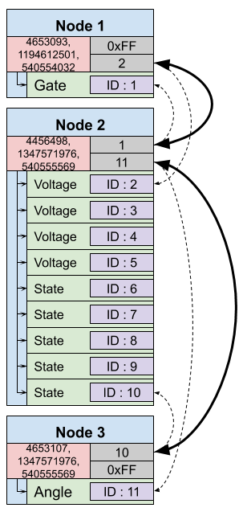

# Network topology

As mentioned in the previous paragraphs, thanks to [Robus](../node/luos.md), the nodes have the capabilty to communicate with each other. However, Robus is not the only necessity to achieve using this characteristic. The nodes can have at any time, knowledge about the position of every other node in the network, by accessing a specific structure, called Routing Table. The routing table, is constructed and shared among the nodes, after the execution of a devoted process called detection.

## Routing Table

The routing table is a feature of Luos allowing every <span class="cust_tooltip">[node](./node.md)<span class="cust_tooltiptext">{{ node_def }}</span></span> to own a "map" (or topology) of the entire network of your device. This map allows nodes to know their physical position, and their different functionalities, as well as to search and interact with the other nodes easily.<br/> The routing table is constructed and shared among all the nodes, after a process that is called [Detection](../services/routing_table.md).


## Modes
As explained in this [page](../basics/basics.md), <span class="cust_tooltip">nodes<span class="cust_tooltiptext">{{ node_def }}</span></span> can host multiple services. To get the topology of your device, the routing table references physical connections between your nodes and lists all the services in each one of them.

The routing table is a table of a `routing_table_t` structure containing nodes or services information.
The maximum number of services and nodes are managed by the precompilation constant `MAX_SERVICES_NUMBER` (set to 40 by default).

```c
routing_table_t routing_table[MAX_SERVICES_NUMBER];
```

The routing table structure has two modes: *service entry mode* and *node entry mode*.

```c
typedef struct __attribute__((__packed__))
{
    entry_mode_t mode;
    union
    {
        struct __attribute__((__packed__))// SERVICE mode entry
        {                               
            uint16_t id;                // Service ID.
            uint16_t type;              // Service type.
            char alias[MAX_ALIAS_SIZE]; // Service alias.
        };
        struct __attribute__((__packed__))// NODE mode entry
        { 
            // Watch out, this structure has a lot of similarities with the node_t struct.
            // It is similar to allow copy of a node_t struct directly in this one
            // but there is potentially a port_table size difference so
            // do not replace it with node_t struct.
            struct __attribute__((__packed__))
            {
                uint16_t node_id : 12;  // Node id
                uint16_t certified : 4; // True if the node have a certificate
            };
            uint16_t port_table[(MAX_ALIAS_SIZE + 2 + 2 - 2) / 2]; // Node link table
        };
        uint8_t unmap_data[MAX_ALIAS_SIZE + 2 + 2];
    };
} routing_table_t;
```

### Node entry mode
This mode gives physical information of your devices.

The **node_id** is the unique number that you can use to identify each one of your nodes. At the beginning (or when a reset detection is perfomed), all node IDs are set to 0. When the RoutingTB_DetectServices API is called, Luos assigns a unique ID to nodes and services in your system topology.

The **certified** Luos node can be certified for your system by including Luos licencing number in your product (feature in progress).

The **port_table** allows sharing of topological information of your network. Each element of this table corresponds to a physical Luos port of the node and indicates which node is connected to it by sharing a node's `id`.

Here is an example:



As shown on this image, elements of the `port_table` indicate the first or last service id of the connected node through a given port.

Specific values taken by `port_table`:

 - **0**: this port is waiting to discover who is connected with. You should never see this value.
 - **0x0FFF**: this port is not connected to any other Node.

> **Note:** Routing tables can be easily displayed using [Pyluos](../../tools/pyluos.md) through a USB [gate](../../tools/gate.md). Please refer to the [Pyluos routing table section](../../tools/pyluos.md) for more information.


### Service entry mode
Except from the node entry mode, there is a second mode, the service entry mode, that allows the `routing_table` to contain information about the smallest entity contained in a node, which is called a service. As a node can host one or more services, the routing table is able to obtain the specific information of each one:
 - id: service's unique id
 - type: service's type
 - alias: service's alias

More information about what the services are and how they are used, are given in the following [pages](../services/services.md).


## PTP
Peer-to-peer connection between nodes for topology detection.

### Daisy-chain
With 2 PTP pins per board, you must chained you device as below:


### Star Mounting
With at least 3 PTP pins per board, you can create a star mounting configuration:
