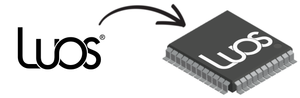

# General guide to Luos technology

Luos is a simple and lightweight containerization platform dedicated to embedded systems enabling <a href="https://en.wikipedia.org/wiki/Microservices" target="_blank">microservices</a> architecture for electronics. It's a powerful tool using modularity to simplify and link any hardware component or application code together as a <a href="https://en.wikipedia.org/wiki/Single_system_image" target="_blank">single system image</a>.

This guide contains all the basic notions you will need to use, create and understand Luos technology.

Luos is a low-level software technology uploaded into every board's ([**node**](#what-is-a-node){{node_def}}) of a device.
You can use Luos as a **bare metal** lib or as a driver into your **embedded OS**.

Luos is composed as well of **code subdivisions** called [**containers**](#container){{container_def}}. Containers are distributed into every nodes in a network.

## What is a Node
A node is a physical component (hardware) running Luos and hosting one or several containers. In a Luos network, nodes are all connected together using Robus{{robus_def}}, the Luos communication technology. In other words, **a node is a microcontroler** connected to other microcontrolers running Luos.
In the Luos philosophy, each node has to carry the necessary programs (containers) allowing it to manage its boards and features.

Nodes can have capacities such as measuring the core temperature, sending the processor's unique ID or input voltage. A node's capacities are commonly shared by all the containers hosted into it and are accessible through each of them.

## Container
A container is a block of code which is able to communicate with any other containers through the Luos network. Each container provides an API allowing to manage a motor, handle a laser range finder, or compute an inverse-kinematics, for example.
**Each container is hosted in a single node**, but a node can handle several containers at the same time and manage communication between them and between other containers hosted in other nodes, using the same interface.

For example, the [Dynamixel board](../demo_boards/boards_list/dxl.md) provided by Luos can dynamically create and manage Dynamixel containers depending on the number of Dynamixel motors linked to it. Any Dynamixel containers can get or set values to other Dynamixel containers on the same node or to any other containers in any other nodes in the network.

[Go to Containers page](../low/containers.md).

## Messages
All containers can share and receive datas using messages.

[Go to Messages handling page](../low/containers/msg-handling.md).

## Routing table
A routing table is a "service" managed by the Luos network and available for any containers in any nodes. This service lists all the containers and allows to any containers to get and use basic information of any other containers. The routing table's data can be loaded or auto-generated during detection.

[Go to Routing table page](../low/containers/routing-table.md).

## Container detection
The container detection assigns IDs to containers depending on their node's physical position in the network, and generates a routing table.

IDs are assigned from the nearest to the furthest node branch by branch, from the point of view of the container running the detection. Following this logic, the container running the detection will have the ID 1, the next one will have the ID 2, etc.

> *Note:* Multiple detection by different containers at the same time is not allowed.

It's possible to detect the network frequently in order to dynamically discover included or excluded containers while running. Go to [Routing table](../low/containers/routing-table.md) page for more informations.

