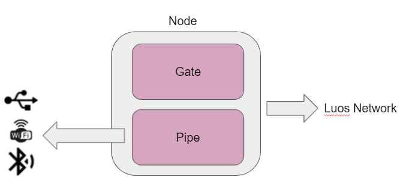
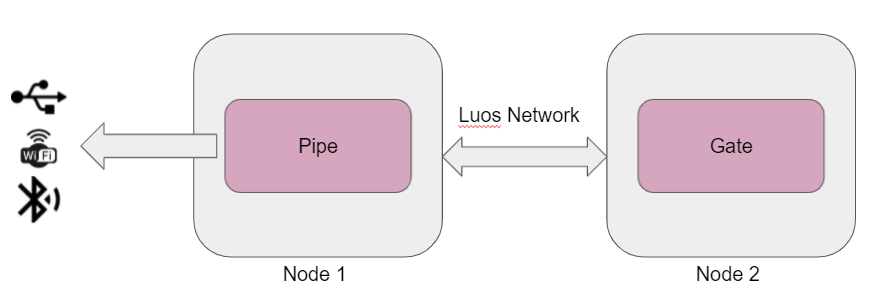

# Gate

The gate is a central tool of the Luos eco-system. It's allowing the translation of any Luos architecture into a more convenient format for standard software ([JSON](../api/api.md) most of the time) and to stream and receive this formatted information using any means of communication, such as serial interface, Wifi, Bluetooth, Lora, ...

You can use it to take control of any embedded service with [any languages](../api/api.md) on any machine. For example, we use it in [Pyluos](./pyluos.md) or [ROS](./ros.md).

The gate is a simple embedded [app service](../luos-technology/services/services.md), so that it can work on any MCU running Luos without any modification.

The gate service must be used with a driver service called **pipe** that can be hosted into different kinds of <span class="cust_tooltip">nodes<span class="cust_tooltiptext">{{node_def}}</span></span> allowing you to choose the communication way fitting with your project (USB, Wifi, Bluetooth, etc.).

## Default gate Process

The default behavior of the gate is optimized for systems that are composed only of drivers and control the entire behavior through a remote machine.

 1. At power-up, the gate makes a network detection to find a pipe service. *(Optional).*
 2. The gate waits to receive a detection message from a pipe.
 3. At detection command, the gate performs a new detection and generates a formatted routing table to send it back to the pipe.
 4. Then the gate evaluates the time needed to convert the entire network values into the selected format. *(Optional)*
 5. the gate sets up all the network services to send back their values at the optimal frequency. *(Optional)*
 6. At this optimal frequency, the gate generates formatted data and sends commands comming from a pipe.

> **Warning:** The gate service refreshes sensors information as fast as possible, so it can be intensive to Luos bandwidth.

The gate and the pipe are two separate services; they can be put on the same node or a separate node.

## Putting a gate and a pipe on the same node

In that configuration, you put two services in the node like below:

```C
#include "luos.h"
#include "pipe.h"
#include "gate.h"

int main(void)
{
  Luos_Init();
  Pipe_Init();
  Gate_Init();

  while (1)
  {
    Luos_Loop();
    Pipe_Loop();
    Gate_Loop();
  }
}
```



In that configuration formatted messages don't pass through the Luos network and stay in localhost.

## A gate and a pipe on separate node

When the gate and the pipe are on separate nodes, formatted messages transit into the network using even more bandwidth and adding latency.



## The gate configurations

The default process described above can be changed using different configurations that you can use on your [node_config.h](../luos-technology/basics/archi.md).

You may need to change it if you have apps on your Luos embedded systems.

| Parameters | Defaults value | Description |
| :---: | :---: | :---: |
| GATE_BUFF_SIZE | 1024 | Maximum size of 1 formatted Data.|
| GATE_POLLING | NOT DEFINED | No autorefresh always ask data (more intensive to Luos bandwidth.) |
| NODETECTION | NOT DEFINED | The gate do not make detection a power up |

If you have an App service on your device managing detections, you should define **NODETECTION** avoiding useless detection from the gate at boot.

If you have an App service on your device using auto-update, you should define **GATE_POLLING** avoiding the gate to take the lead on the services your App is using.
