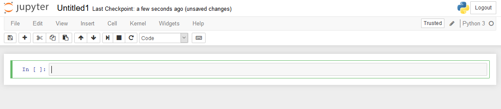
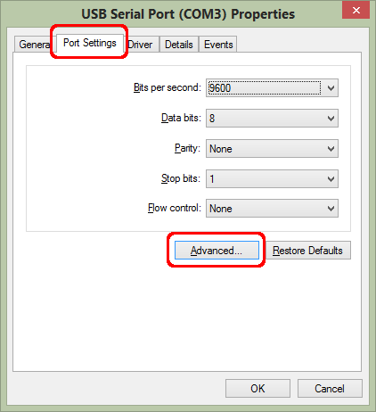
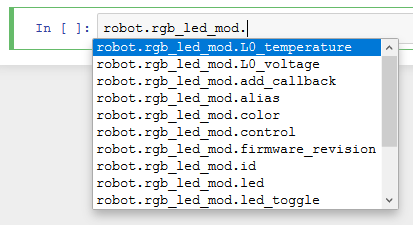

# Pyluos

<h1><a href="#pyluos" class="header" id="pyluos"> / A Pyluos guide</a></h1>

Pyluos is the standard Python library to manage a Luos system with a computer. In this tutorial, you will learn how to install Pyluos in order to use Luos with Python on a computer through a [gate](./gate.md) service.

## Installation

### Required: Installing Python and Pip

> **Warning:** In order to use Pyluos library, Python and the Pip package manager must be installed on your computer.

_« Python is a programming language that lets you work more quickly and integrate your systems more effectively. » (<small><a href="https://python.org" target="_blank">Source &#8599;</a></small>)_

_« <a href="https://pip.pypa.io/en/stable/" target="_blank">Pip &#8599;</a> is the standard package manager for Python. It allows you to install and manage additional packages that are not part of the Python standard library. » (<small><a href="https://realpython.com/what-is-pip/#getting-started-with-pip" target="_blank">Source &#8599;</a></small>)_

If Python is not installed on your computer, download and run the last release according to your computer's OS: <a href="https://www.python.org/downloads/" target="_blank">https://www.python.org/downloads/ &#8599;</a>.

To install Pip, type the following commands in a console:

```bash
curl https://bootstrap.pypa.io/get-pip.py -o get-pip.py
python get-pip.py
```

### Installing Jupyter Notebook

The tool *Jupyter Notebook* is needed for this tutorial. Jupyter Notebook will allow you to type Python commands in an internet browser to communicate with a Luos system, via Pyluos.

*« The Jupyter Notebook App is a server-client application that allows editing and running notebook documents via a web browser. The Jupyter Notebook App can be executed on a local desktop requiring no internet access (...) or can be installed on a remote server and accessed through the internet. » (<small><a href="https://jupyter-notebook-beginner-guide.readthedocs.io/en/latest/what_is_jupyter.html" target="_blank">Source &#8599;</a></small>)*

Type the following command in the console to install Jupyter:

```bash
pip install jupyter
```

> **Note:** Feel free to consult <a href="https://jupyter.readthedocs.io/en/latest/content-quickstart.html" target="_blank">_Jupyter Notebook_'s &#8599;</a> documentation.

### Installing or updating Pyluos library

You are now ready to install Pyluos. **The last Pyluos version is `{{last_version_pyluos}}`.**

In a console, the following command will install the *Pyluos* library using the *Pip package manager*:

```bash
pip install pyluos
```

If Pyluos is already installed, it may only need to be updated:

```bash
pip install --upgrade pyluos
```

Pyluos also provides auto-generated pre-releases for advanced developers. You can get it using:

```bash
pip install --pre pyluos
```

## Start using Jupyter Notebook and Pyluos

*Jupyter Notebook* can be launched through a console:

```bash
jupyter notebook
```

In the browser page that opened, the `New` button creates a new Python file:


> **Note:** In the previous picture, *Jupyter* uses *Python 3*, but you also can use *Python 2.7* depending on your computer configuration.



The Jupyter work space looks like the following image. On the keyboard, `Shift+Enter` executes any selected part of the code.

Now you are ready to code using Python.

### Import Pyluos

The first thing to do is to call the Pyluos library along with the `Device` tool inside that library:

```python
from pyluos import Device
```

This line is always used while programming behaviors and should be called before any connection with the device is made.

### Device connection

Connect your device to your computer through a [gate](./gate.md) with a USB cable.

#### Configuring USB transfer sizes and latency timer

Some devices may not work correctly with the default USB transfer sizes and latency timer for COM ports on Windows. These parameters can be set to lower values in order to use your device correctly while connected to your computer from a [gate](./gate.md).

**USB Transfer Sizes**: The default value is 4096 Bytes; however if you have issues using your connected device, you should try the minimum possible values both for `Receive` and `Transmit`.

**Latency Timer**: The default value is 16 msec, but you can rise lower it to the minimal value of 1 msec.

To access to these parameters, open the Device Manager in Windows, right-click on the *USB Serial Port (COMX)* where your device is connected, and click on *Properties*.


Click on *Port Settings* tab and click on *Advanced...* button.



Change the desired values.


These values can give you better results, for example if your device has motors to control.

#### Connection to the device

Now you should be ready to use the Pyluos library and connect to your device. To do that, you have to create a device object with your device address as an argument.

Your device address can be an IP address (`192.168.0.6` or `my_device.local`, for example) or a serial port (`COM13` on Windows or `/dev/cu.usbserial-DN2YEFLN` on Mac).

```python
device = Device('address of the device')
```

This line makes the connexion between the computer and the device. Python should answer with this kind of message:

`Connected to "address to the device".`<br />
`Sending detection signal.`<br />
`Waiting for first state...`<br />
`Device setup.`

Only once the connection is set is it possible to start programming behaviors.


### Routing table display

[Routing table](../luos-technology/node/topology.md) can be readily displayed using Pyluos.

Pyluos can display a list of all the services and their associated characteristics (type, alias, and ID) by filtering the routing table.
To display it, use the following command:

```python
device.services
```

> **Note:** `device` is the name of the network.

Pyluos will give you a list of all services without any topological information:

```AsciiDoc
-------------------------------------------------
Type                Alias               ID
-------------------------------------------------
Gate                gate                1
Pipe                pipe                2
Voltage             analog_read_P1      3
Voltage             analog_read_P7      4
Voltage             analog_read_P8      5
Voltage             analog_read_P9      6
State               digit_read_P5       7
State               digit_read_P6       8
State               digit_write_P2      9
State               digit_write_P3      10
State               digit_write_P4      11
Angle               potentiometer_m     12
```

Pyluos also can interpret the routing table and transform it into a tree. This way, we can display a lot more complete information using the following command:

```python
device.nodes
```

> **Note:** `device` is the name of the network.

Based on the previous example, Pyluos will give you all information about services and topological information:

```AsciiDoc
  ┏━━━━━━━━━━━━━━━━━━━━━━━━━━━━━━━━━━━━━━━━━━━━━━━━━━┓
  ┃  ╭node 1                Certified            ┃
  ┃  │  Type                Alias           ID   ┃
  ┃  ├> Gate                gate            1    ┃
  ┃  ╰> Pipe                pipe            2    ┃
╔>┗━━━━━━━━━━━━━━━━━━━━━━━━━━━━━━━━━━━━━━━━━━━━━━━━━━┛
║     ┏━━━━━━━━━━━━━━━━━━━━━━━━━━━━━━━━━━━━━━━━━━━━━━━━━━┓
╚══ 0>┃1 ╭node 2                Certified            ┃
      ┃  │  Type                Alias           ID   ┃
      ┃  ├> Voltage             analog_read_P1  3    ┃
      ┃  ├> Voltage             analog_read_P7  4    ┃
      ┃  ├> Voltage             analog_read_P8  5    ┃
      ┃  ├> Voltage             analog_read_P9  6    ┃
      ┃  ├> State               digit_read_P5   7    ┃
      ┃  ├> State               digit_read_P6   8    ┃
      ┃  ├> State               digit_write_P2  9    ┃
      ┃  ├> State               digit_write_P3  10   ┃
      ┃  ╰> State               digit_write_P4  11   ┃
    ╔>┗━━━━━━━━━━━━━━━━━━━━━━━━━━━━━━━━━━━━━━━━━━━━━━━━━━┛
    ║     ┏━━━━━━━━━━━━━━━━━━━━━━━━━━━━━━━━━━━━━━━━━━━━━━━━━━┓
    ╚══ 0>┃1 ╭node 3                Certified            ┃
          ┃  │  Type                Alias           ID   ┃
          ┃  ╰> Angle               potentiometer_m 12   ┃
         >┗━━━━━━━━━━━━━━━━━━━━━━━━━━━━━━━━━━━━━━━━━━━━━━━━━━┛
```

In this example, three nodes (MCUs) and their associated UUID are listed, along with their services and related characteristics (type, alias, and ID).
The characters after each set of node's services and before the UUID's next node specify which connector is used. For example, `1<=>0` means the first node is connected from its second connector (1) to the first connector (0) of the next node.

### Service type

Each service has a type (e.g. `Button`, `Led`, etc.).
You can either retrieve the service's type from the previous code or with the following line:

```python
device.service_alias.type
```

`service_alias` is the alias you got from the previous listing.

> **Note:** *Unknown* service types are defaulty set for custom service types such as some [Luos apps](../luos-technology/services/service_type.md).

### Get and set services information

Once you have detected your services, you can use this information like variables.

To access values, you have to address them in the device object following these rules:

```python
device.service_alias.variable
```

For example:

```python
device.rgb_led_mod.color = [50,80,5] # Changes the color of the LED in the "rgb_led_mod" service

device.button_mod.state # Returns the status of the push-button

device.button_mod.type # Returns the service type of the service "button_mod"

device.button_mod.luos_revision # Returns the version of Luos

device.button_mod.robus_revision # Returns the version of Robus
```

If you use *ipython* or *Jupyter Notebook*, you can use auto-completion using the `Tab` key to find every available object and variable.



### Change a service name

The name of any service can be changed by using this code:

```python
device.service_alias.rename("new_name")
```

For example:

```python
device.rgb_led_mod.rename("myLED")
```

> **Note:** You should restart your device and reconnect to it after this operation.

> **Note:** To get back to the service default name, set a void name (`""`).

### Get a node's statistics

Nodes can send back some values representing the sanity of a node. You can use it to evaluate the Luos needs depending on your particular configuration.
The RAM usage of Luos depends on the number of messages the node has to treat and the max Luos loop delay.

```python
device.service_alias.luos_statistics
```

For example:

```python
device.gate.luos_statistics
```
```AsciiDoc
gate statistics :
.luos allocated RAM occupation  = 53%
  .Message stack                = 50%
  .Luos stack                   = 53%
.Dropped messages number        = 0
.Max Luos loop delay            = 16ms
.Msg fail ratio                 = 0%
.Nak msg max number             = 1
.Collision msg max number       = 5
```
 - **luos allocated RAM occupation** represents the global Luos RAM usage based on **Message stack** and **Luos stack**. You can use this value to know if you need to expand or reduce the amount of RAM dedicated to Luos through the `MAX_MSG_NB` configuration flag (equals to `2 * MAX_SERVICE_NUMBER` where MAX_SERVICE_NUMBER = 5 by default ).

 - **Dropped messages number** represents the number of messages dropped by Luos. Luos is able to drop messages if they are too old and consume too much memory. If you experience message drops, you should increase the `MSG_BUFFER_SIZE` configuration flag (equals to `3 * sizeof(msg_t)` by default. sizeof(msg_t) -> 7 bytes Header + 128 bytes data).

- Unlike **Message stack**, **Luos stack**, and **Max Luos loop delay** which are all nodes' relative statistics, **Msg fail ratio** and **NAK msg max number** are services' statistics. **Msg fail ratio** gives a ratio of the failed sent messages based on all the messages that the service has sent. **NAK msg max number** gives the maximum number of NAK received when a message has been sent.

 - The RAM occupation and message drop number are also related to **Max Luos loop delay**. If **Max Luos loop delay** is too big, Luos has to buffer more messages between loop executions and consumes more RAM. You can reduce the RAM consumption and messages dropping by reducing the **Max Luos loop delay**. To do that, you have to call the `Luos_Loop()` function more frequently.

### Full script

```python
from pyluos import Device
device = Device('address of the device')

device.services

device.rgb_led_mod.color = [50,80,5]
device.button_mod.state
device.button_mod.type

device.rgb_led_mod.rename("myLED")
```
