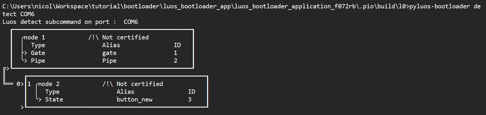

# Bootloader

In this tutorial, you will learn to use the bootloader feature offered by Luos technology. 

The setup is simple and is composed of two l0 boards (see [boards](../luos-demo/demo.md) for further informations on boards we are using). These boards are chained following rules described in [hardware considerations](../../hardware-consideration/electronics.md).

We will use one of these nodes as a [gate](../../tools/gate.md), and the other as an application node. The second node will host a bootloader and you will be able to update its firmware through the gate. You need a USB shield to connect on the the first node to complete this tutorial.

<p align="center">
  
</p>

> **Nota**: it's not possible to update firmware on a gate node.

### Step 1: Setup development environment

First thing to do is to install [pyluos](../../tools/pyluos.md) and [PlatformIO](../../get_started/getting_started.md) if not already done.

Then we will create a working folder on our desktop machine and clone three repositories containing respectively: a gate project, the bootloader and an application example using the bootloader.

```bash
cd home/workspace/ 
mkdir tutorial
cd tutorial/
mkdir bootloader
cd bootloader/

git clone https://github.com/Luos-io/Examples.git
git clone https://github.com/Luos-io/Luos_bootloader.git
git clone https://github.com/Luos-io/luos_bootloader_app.git
```

Your folder should then look like this:

<p align="center">
  
</p>

If not, please follow the commands listed above.

### Step 2: Load gate program

Open Visual Studio Code. On the top left corner, in the **Explorer** section, click on **Add Folder.** Search **Gate_SerialCom** project in **Examples/Projects/l0**:

<p align="center">
  
</p>

Click on **Add** and the folder should appear in the explorer section: 

<p align="center">
  
</p>

Now take your first node with the USB shield and connect a USB cable from your PC to the port used for **dfu** programming (the USB port on the l0 board). 

Click on **Upload** on bottom left corner of the IDE. Wait for the compilation and flashing to be completed. If success, you should see the following: 

<p align="center">
  
</p>

If not, please verify you're connected on the right port of the device.

### Step 3: Detect gate node with the CLI

You can now detect your luos node with the CLI: connect your USB cable on the USB shield port instead of the dfu port and type the following command in a terminal:

```bash
pyluos-bootloader detect COM6
```

<p align="center">
  
</p>

> COM6 is the identifier of the serial port used to communicate with your node. It's unique for each shield, you can check yours with the **Device Manager** in Windows or **ls -l /dev/ | grep ttyUSB** on linux

If the command is not recognized by the PC, verify your pyluos installation (see **Step 1**). After execution, you should see the following:

### Step 4: Load the bootloader

Now, you will load the bootloader in the second node. Follow the same process as described in **Step 2** but open **Luos_bootloader/luos_bootloader_f072RB** project.

Connect the second node with the **dfu** port and click on **Upload**, you should see the following:

<p align="center">
  
</p>

### Step 5: Detection

Connect your two nodes through the luos network and connect your USB shield to your PC. Type the same command used on **Step 3** and you should see the following: 

<p align="center">
  
</p>

**boot_service** indicates there is a bootloader running on your node. You are now able to communicate with it through the gate and load any application.

### Step 6: Compile an app compatible with the bootloader

Some applications examples are available with the bootloader feature and they can be used as template for your custom application. They can be found in **luos_bootloader_app/.** As we are using l0 boards, open **luos_bootloader_app/luos_bootloader_application_f072RB** in VSCode.

This time, click on **Build** instead of **Upload** as you don't want to download it to the node: the bootloader will do it for you. 

<p align="center">
  
</p>

The generated binary file can be found in **luos_bootloader_app/luos_bootloader_application_f072rb/.pio/build/l0,** its name is **firmware.bin.** You can use the bootloader to load it: 

```bash
cd luos_bootloader_app/luos_bootloader_application_f072rb/.pio/build/l0

pyluos-bootloader flash COM6 -t 2 -b firmware.bin
```

> For further information on options used with the CLI, please read the dedicated documentation [link to the doc] or type the following command:

```bash
pyluos-bootloader --help
```

The following lines should appear after typing the command: 

<p align="center">
  
</p>

> If any problem appears during the loading process, please reboot your system and retry to type the command (you can also find informations in [link to the doc]).

Then relaunch a detection (as done in **Step 3**): 

<p align="center">
  
</p>

You can see that **boot_service** has been replaced by **button_old** which is the name of the service running in your app: the bootloader switched to application mode and launched your app.

### Step 7: Update your app

You also can update your app and reload it in the node. As an example, change the name of your service from **button_old** to **button_new:**

<p align="center">
  
</p>

Load the app with the bootloader and relaunch a detection:

```bash
pyluos-bootloader flash COM6 -t 2 -b firmware.bin

pyluos-bootloader detect COM6
```

You should see your updated service running in your node:

<p align="center">
  
</p>

You have reached the end of this tutorial. You're now able to use the bootloader feature included in **Luos**. You have the basics but you can find some useful informations in the dedicated documentation [link to the doc].