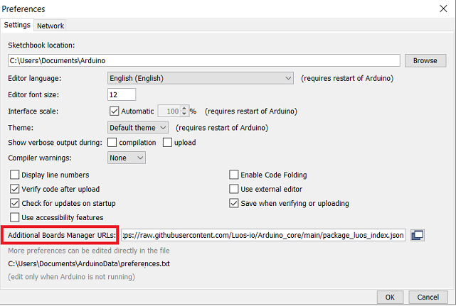
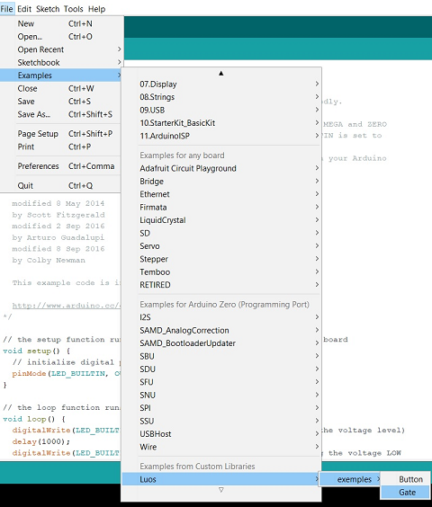

# Set up a Luos-Arduino project tutorial

## Introduction to Arduino

The Luos library can be used with PlatformIO, the IDE Luos company uses, but you can also use Arduino IDE.

For now, only Arduino SAM Board 32-bits ARM cortex-M0+ are compatible with Luos Library.

You can download Arduino IDE compatible example and Luos Library with <a href="https://github.com/Luos-io/Luos/releases" target="_blank">Luos Release &#8599;</a>.


<a href="https://www.arduino.cc/" target="_blank">Arduino &#8599;</a> is an open-source electronic platform based on easy-to-use hardware and software. The Luos library can be used in Arduino IDE and examples are provided to test it on Arduino hardware quickly. For now, only Arduino SAM Board 32-bits ARM cortex-M0+ are compatible with Luos Library (Arduino Zero, Arduino MKR Wifi, Arduino MKR FOX, Arduino MKR WAN, Arduino MKR GSM, Arduino NB, etc.).

Creating a Luos Network with an Arduino board is very easy. Use D0 and D1 for Tx and Rx, D2 and D3 for Rx_En and Tx_En (RS485 configuration), D5 and D6 for PTPA and PTPB. See the [hardware topics](../../hardware-consideration/hardware-consideration.md) page for more information.

## Getting Started

 1. Install the Ardiuno IDE from the <a href="https://www.arduino.cc/" target="_blank">Arduino &#8599;</a> website.
 2. Copy and paste the following URL into the *File > Preferences > "Additional Boards Manager"* textbox.
 ```Json
https://raw.githubusercontent.com/Luos-io/Arduino_core/main/package_luos_index.json
```
 <p align="center">
    
</p>

 3. Install the Luos adapted Arduino SAMD Library in *Boards > "Add board definition" > Search for "Luos" > Install "Luos adapted Arduino SAMD (32-bits ARM Cortex-M0+) Boards"*

 4. Install the official Arduino SAMD Library in *Boards > "Add board definition" > Search for "SAMD" > Install Arduino SAMD Library*:

 <p align="center">
    
</p>

 5. Download Luos Library for Arduino environment with an example <a href="https://github.com/Luos-io/Luos/releases" target="_blank">on GitHub &#8599;</a>.

 6. Include Luos Library for Arduino to your Arduino IDE:

 <p align="center">
    
</p>

 7. Use provided Luos example, then compile and upload it to your Arduino board:

 <p align="center">
    
</p>
